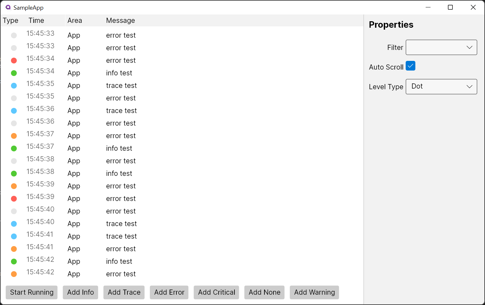

# 🦟 Aldwych.LogView
An [Avalonia UI](http://avaloniaui.net/) Log Control that integrates with [Microsoft.Extensions.Logging](https://www.nuget.org/packages/Microsoft.Extensions.Logging/)


## Log Provider
The LogView comes with a log provider which will handle intercepting log massages for display. The most basic way of using this would be: 
```csharp
//Create a log provider
var provider = new LogControlLoggerProvider(new LogControlLoggerConfiguration() 
{ 
    LogLevel = LogLevel.Trace 
});
// Create a logger
var logger = provider.CreateLogger("App");

//Log something 
logger.LogInformation("info test");
```


## Basic Theme 

### Usage
Edit the App.axaml file to look like the following: 
```xml
<Application.Styles>
    <FluentTheme Mode="Dark"/>
    <StyleInclude Source="avares://Aldwych.LogView/BasicTheme.axaml"/>
</Application.Styles>
```
### Resource Names 
You can tweak the basic theme by overriding the resources listed below.
#### Color Resources
```xml
<SolidColorBrush x:Key="DebugForeground" Color="#5EC8E1" />
<SolidColorBrush x:Key="ErrorForeground" Color="#FF6057" />
<SolidColorBrush x:Key="InfoForeground" Color="#51CA33" />
<SolidColorBrush x:Key="WarningForeground" Color="#FF9D42" />
<SolidColorBrush x:Key="TraceForeground" Color="#5EC8E1" />
<SolidColorBrush x:Key="CriticalForeground" Color="#E5E5E5" />
```

#### Icon Resources
```xml
<StreamGeometry x:Key="DebugLogMessageGeometry">...</StreamGeometry>
<StreamGeometry x:Key="ErrorLogMessageGeometry">...</StreamGeometry>
<StreamGeometry x:Key="InfoLogMessageGeometry">...</StreamGeometry>
<StreamGeometry x:Key="WarningLogMessageGeometry">...</StreamGeometry>
<StreamGeometry x:Key="TraceLogMessageGeometry">...</StreamGeometry>
<StreamGeometry x:Key="CriticalLogMessageGeometry">...</StreamGeometry>
```

## Sample App 
### Light 


### Dark

